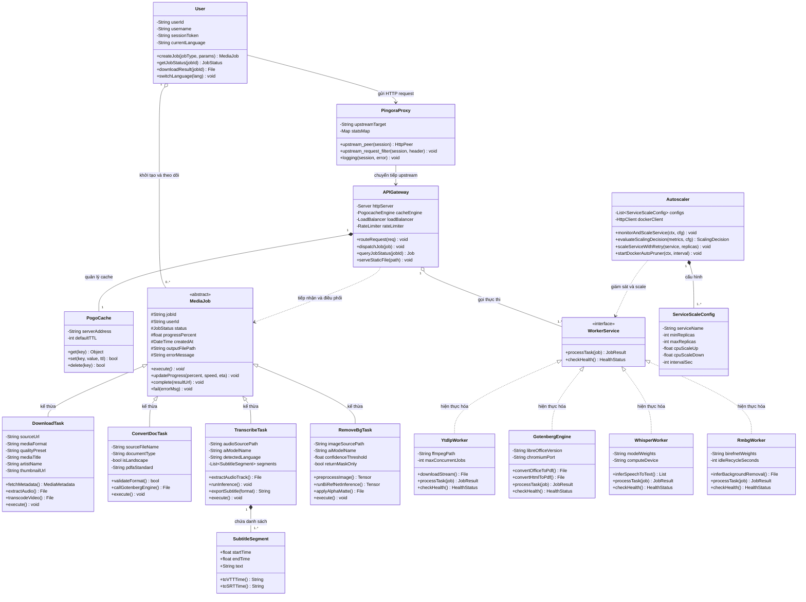

# Tên đề tài: Xây Dựng Ứng Dụng Quản Lí Đa Phương Tiện ONIVERSE - MULTI MEDIA & AI TOOLS
---
## **Nhóm 1**
- Thành viên:
  - Tống Nguyễn Bảo Long - MSSV: 23010111
  - Trần Bùi Nguyên Dương - MSSV: 23010570

---

## 3. Phân tích bài toán

Bài toán đặt ra là xây dựng một nền tảng trực tuyến tổng hợp (All-in-One) cho phép người dùng xử lý đa phương tiện và ứng dụng trí tuệ nhân tạo (AI) bao gồm: Tải media từ URL (YouTube, TikTok, Facebook,...), chuyển đổi văn bản sang PDF chuẩn văn phòng, bóc tách phụ đề giọng nói bằng mô hình Whisper AI và xóa phông nền hình ảnh bằng AI.

---

### 3.1. Phân tích các đối tượng (Object Analysis)

Hệ thống được thiết kế hướng đối tượng theo kiến trúc phân tầng (Layered Architecture) kết hợp mô hình Microservices. Các đối tượng chính được phân tích chi tiết gồm:

#### 1. Đối tượng `User` (Người dùng)
Đại diện cho người dùng tương tác với hệ thống thông qua giao diện Web SPA:
* **Thuộc tính (Attributes):**
  * `- String userId`: Mã định danh duy nhất của người dùng hoặc phiên làm việc (Session/UUID).
  * `- String username`: Tên tài khoản người dùng (nếu có đăng nhập).
  * `- String sessionToken`: Token xác thực phiên làm việc.
  * `- String currentLanguage`: Ngôn ngữ hiển thị đang chọn (`"vi"` hoặc `"en"`).
* **Phương thức (Methods):**
  * `+ createJob(jobType, params): MediaJob`: Khởi tạo một tác vụ xử lý mới.
  * `+ getJobStatus(jobId): JobStatus`: Kiểm tra tiến độ tác vụ đang thực thi.
  * `+ downloadResult(jobId): File`: Tải tệp kết quả sau khi xử lý thành công.
  * `+ switchLanguage(lang): void`: Thay đổi ngôn ngữ giao diện.

---

#### 2. Lớp trừu tượng `MediaJob` (Tác vụ nền cơ sở)
Lớp cơ sở trừu tượng (`<<abstract>>`) định nghĩa cấu trúc dữ liệu và hành vi dùng chung cho mọi loại tác vụ chuyển đổi/xử lý trong hệ thống:
* **Thuộc tính (Attributes):**
  * `# String jobId`: Mã số định danh duy nhất của tác vụ (UUID/Hex).
  * `# String userId`: Định danh người dùng sở hữu tác vụ.
  * `# JobStatus status`: Trạng thái xử lý (`"queued"`, `"processing"`, `"completed"`, `"error"`).
  * `# float progressPercent`: Tiến độ hoàn thành (từ 0.0% đến 100.0%).
  * `# DateTime createdAt`: Thời điểm tác vụ được tạo.
  * `# String outputFilePath`: Đường dẫn lưu tệp kết quả trên hệ thống.
  * `# String errorMessage`: Thông báo lỗi chi tiết nếu quá trình xử lý thất bại.
* **Phương thức (Methods):**
  * `+ execute()*: void`: Phương thức trừu tượng thực thi nghiệp vụ của từng loại tác vụ.
  * `+ updateProgress(percent, speed, eta): void`: Cập nhật trạng thái và tiến độ.
  * `+ complete(resultUrl): void`: Đánh dấu hoàn thành và lưu đường dẫn tải về.
  * `+ fail(errorMsg): void`: Ghi nhận lỗi và hủy tác vụ.

---

#### 3. Đối tượng `DownloadTask` (Tác vụ tải Media)
Kế thừa từ `MediaJob`, chuyên trách việc tải và trích xuất âm thanh/video từ các URL mạng xã hội:
* **Thuộc tính (Attributes):**
  * `- String sourceUrl`: Đường dẫn liên kết video/âm thanh gốc.
  * `- String mediaFormat`: Định dạng xuất (`"mp3"` hoặc `"mp4"`).
  * `- String qualityPreset`: Mức chất lượng mong muốn (`"128k"`, `"192k"`, `"320k"`, `"720p"`, `"1080p"`).
  * `- String mediaTitle`: Tiêu đề bài hát/video trích xuất được.
  * `- String artistName`: Tên nghệ sĩ/kênh phát hành.
  * `- String thumbnailUrl`: Ảnh đại diện của video.
* **Phương thức (Methods):**
  * `+ fetchMetadata(): MediaMetadata`: Lấy thông tin tiêu đề, thời lượng, thumbnail trước khi tải.
  * `+ extractAudio(): File`: Trích xuất âm thanh với bitrate tương ứng.
  * `+ transcodeVideo(): File`: Xử lý và ghép luồng hình ảnh/âm thanh video.
  * `+ execute(): void`: Hiện thực hóa quy trình tải và chuyển đổi media.

---

#### 4. Đối tượng `ConvertDocTask` (Tác vụ chuyển đổi PDF)
Kế thừa từ `MediaJob`, chuyên trách chuyển đổi các định dạng văn bản, bảng tính, trình chiếu sang file PDF:
* **Thuộc tính (Attributes):**
  * `- String sourceFileName`: Tên tệp tài liệu gốc được người dùng tải lên.
  * `- String documentType`: Đuôi tệp mở rộng (`"docx"`, `"xlsx"`, `"pptx"`, `"md"`, `"txt"`, `"html"`).
  * `- bool isLandscape`: Hướng in trang tài liệu (khổ ngang hoặc khổ dọc).
  * `- String pdfaStandard`: Chuẩn lưu trữ hồ sơ PDF/A (`"PDF/A-1b"`, `"PDF/A-2b"`,...).
* **Phương thức (Methods):**
  * `+ validateFormat(): bool`: Kiểm tra tính hợp lệ và dung lượng của tệp đầu vào.
  * `+ callGotenbergEngine(): File`: Gửi yêu cầu chuyển đổi tới Gotenberg v8 API.
  * `+ execute(): void`: Thực hiện chuyển đổi và lưu file PDF đầu ra.

---

#### 5. Đối tượng `TranscribeTask` (Tác vụ nhận diện giọng nói AI)
Kế thừa từ `MediaJob`, ứng dụng mô hình OpenAI Whisper để chuyển đổi tiếng nói trong file âm thanh/video thành văn bản:
* **Thuộc tính (Attributes):**
  * `- String audioSourcePath`: Đường dẫn tệp âm thanh đầu vào.
  * `- String aiModelName`: Tên mô hình Whisper sử dụng (`"tiny"`, `"base"`, `"small"`, `"large-v3"`).
  * `- String detectedLanguage`: Ngôn ngữ được AI tự động nhận diện.
  * `- List<SubtitleSegment> segments`: Danh sách các câu thoại kèm mốc thời gian chi tiết.
* **Phương thức (Methods):**
  * `+ extractAudioTrack(): File`: Tách luồng âm thanh chuẩn mono 16kHz phục vụ mô hình.
  * `+ runInference(): void`: Chạy suy luận nhận diện văn bản từ âm thanh.
  * `+ exportSubtitle(format): String`: Xuất phụ đề theo định dạng chuẩn (`"srt"`, `"vtt"`, `"txt"`).
  * `+ execute(): void`: Hiện thực hóa chu trình bóc tách phụ đề.

---

#### 6. Đối tượng `SubtitleSegment` (Đoạn phụ đề)
Đối tượng thành phần cấu thành nên kết quả nhận diện giọng nói của `TranscribeTask`:
* **Thuộc tính (Attributes):**
  * `+ float startTime`: Thời điểm bắt đầu của câu thoại (giây).
  * `+ float endTime`: Thời điểm kết thúc của câu thoại (giây).
  * `+ String text`: Nội dung văn bản được nhận dạng.
* **Phương thức (Methods):**
  * `+ toVTTTime(): String`: Chuyển đổi timestamp sang chuẩn WebVTT (`00:01:23.450`).
  * `+ toSRTTime(): String`: Chuyển đổi timestamp sang chuẩn SubRip (`00:01:23,450`).

---

#### 7. Đối tượng `RemoveBgTask` (Tác vụ xóa phông nền AI)
Kế thừa từ `MediaJob`, sử dụng mô hình thị giác máy tính BiRefNet để bóc tách chủ thể khỏi nền ảnh:
* **Thuộc tính (Attributes):**
  * `- String imageSourcePath`: Đường dẫn ảnh gốc (JPEG, PNG, WebP).
  * `- String aiModelName`: Mô hình BiRefNet SOTA.
  * `- float confidenceThreshold`: Ngưỡng độ tin cậy của mặt nạ phân đoạn (mask).
  * `- bool returnMaskOnly`: Tùy chọn chỉ lấy mặt nạ đen trắng hay ảnh PNG trong suốt.
* **Phương thức (Methods):**
  * `+ preprocessImage(): Tensor`: Chuẩn hóa kích thước và ma trận điểm ảnh đầu vào.
  * `+ runBiRefNetInference(): Tensor`: Chạy mô hình phân đoạn đối tượng.
  * `+ applyAlphaMatte(): File`: Ghép mặt nạ alpha và xuất file PNG nền trong suốt.
  * `+ execute(): void`: Hiện thực hóa toàn bộ luồng tách nền.

---

#### 8. Đối tượng `APIGateway` (Cổng điều phối trung tâm)
Đóng vai trò là máy chủ trung gian (viết bằng Golang), đón nhận request từ Client, kiểm tra giới hạn (Rate Limiting), điều phối tác vụ tới các worker thích hợp:
* **Thuộc tính (Attributes):**
  * `- Server httpServer`: Web server xử lý HTTP/REST.
  * `- PogocacheEngine cacheEngine`: Tham chiếu tới dịch vụ bộ nhớ đệm phân tán.
  * `- LoadBalancer loadBalancer`: Bộ cân bằng tải động cho các microservice.
  * `- RateLimiter rateLimiter`: Bộ kiểm soát số lượng request trên mỗi IP.
* **Phương thức (Methods):**
  * `+ routeRequest(req): void`: Định tuyến yêu cầu đến handler nghiệp vụ tương ứng.
  * `+ dispatchJob(job): void`: Đẩy tác vụ vào hàng đợi hoặc giao cho worker xử lý.
  * `+ queryJobStatus(jobId): Job`: Truy vấn thông tin và tiến độ tác vụ từ Cache/DB.
  * `+ serveStaticFile(path): void`: Trả về kết quả tệp thành phẩm cho người dùng.

---

#### 9. Đối tượng `PogoCache` (Quản lý bộ nhớ đệm)
Quản lý trạng thái tác vụ, giảm tải cho máy chủ xử lý tác vụ nặng khi có các yêu cầu trùng lặp:
* **Thuộc tính (Attributes):**
  * `- String serverAddress`: Địa chỉ kết nối socket (`pogocache:9401`).
  * `- int defaultTTL`: Thời gian sống mặc định của dữ liệu trong cache (Time-To-Live).
* **Phương thức (Methods):**
  * `+ get(key): Object`: Đọc dữ liệu từ bộ nhớ đệm.
  * `+ set(key, value, ttl): bool`: Ghi dữ liệu vào bộ nhớ đệm kèm thời gian hết hạn.
  * `+ delete(key): bool`: Xóa phần tử khỏi bộ nhớ đệm.

---

#### 10. Interface `WorkerService` và các Workers thực thi
Interface định nghĩa chuẩn giao tiếp giữa API Gateway với các vi dịch vụ (Microservices):
* **Interface `WorkerService`:**
  * `+ processTask(job: MediaJob): JobResult`
  * `+ checkHealth(): HealthStatus`
* **Các lớp triển khai cụ thể:**
  * `YtdlpWorker`: Triển khai bởi service `worker_ytdlp` (Python / yt-dlp / FFmpeg).
  * `GotenbergEngine`: Triển khai bởi container Gotenberg v8 (Chromium & LibreOffice).
  * `WhisperWorker`: Triển khai bởi service `worker_whisper` (Python / Faster-Whisper / PyTorch).
  * `RmbgWorker`: Triển khai bởi service `worker_rmbg` (Python / BiRefNet / OpenVINO).

---

### 3.2. Phân tích mối quan hệ giữa các đối tượng (Relationship Analysis)

Mối quan hệ giữa các đối tượng trong hệ thống được xác lập dựa trên các nguyên lý lập trình hướng đối tượng (OOP):

1. **Quan hệ Kế thừa (Inheritance / Generalization):**
   * Lớp trừu tượng `MediaJob` đóng vai trò là lớp cha (Superclass).
   * Bốn lớp con: `DownloadTask`, `ConvertDocTask`, `TranscribeTask`, `RemoveBgTask` đều kế thừa (`is-a`) các thuộc tính cơ sở (`jobId`, `status`, `progressPercent`) và ghi đè phương thức `execute()` để hiện thực hóa nghiệp vụ đặc thù của từng chức năng.

2. **Quan hệ Hiện thực hóa (Realization / Implementation):**
   * Các Worker chuyên trách (`YtdlpWorker`, `GotenbergEngine`, `WhisperWorker`, `RmbgWorker`) cùng hiện thực hóa Interface `WorkerService`. Điều này đảm bảo tính lỏng lẻo (Loose Coupling) của hệ thống: Gateway có thể thêm hoặc thay thế Worker mà không làm thay đổi cấu trúc mã nguồn chung.

3. **Quan hệ Kết tập (Aggregation) và Hợp thành (Composition):**
   * **`User` kết tập `MediaJob` (Aggregation `1 - n`):** Một người dùng trong một phiên làm việc có thể tạo ra nhiều tác vụ xử lý khác nhau. Khi phiên kết thúc, lịch sử tác vụ có thể vẫn được lưu lại trong cache hệ thống.
   * **`APIGateway` hợp thành `PogoCache` (Composition `1 - 1`):** Bộ nhớ đệm là một thành phần không thể tách rời của Gateway, được khởi tạo cùng vòng đời với Gateway server.
   * **`TranscribeTask` hợp thành `SubtitleSegment` (Composition `1 - n`):** Một tác vụ phụ đề chứa một tập hợp các đoạn phụ đề theo mốc thời gian. Nếu tác vụ bị xóa, các đoạn phụ đề thành phần cũng bị xóa theo.

4. **Quan hệ Phụ thuộc (Dependency):**
   * `APIGateway` phụ thuộc (`use-a`) vào `MediaJob` để nhận dữ liệu yêu cầu từ Client và đóng gói trả về kết quả.
   * Mỗi lớp tác vụ chuyên biệt phụ thuộc vào Worker tương ứng để thực hiện tính toán nặng (VD: `DownloadTask` phụ thuộc `YtdlpWorker`, `RemoveBgTask` phụ thuộc `RmbgWorker`).

---

### 3.3. Sơ đồ chức năng tổng thể của bài toán (UML Class Diagram)

Dưới đây là sơ đồ lớp UML biểu diễn chi tiết toàn bộ các thực thể, thuộc tính, phương thức và mối quan hệ chức năng tổng thể của ứng dụng:

---

#### Giải thích các phân vùng chức năng trong sơ đồ:

1. **Tầng Giao diện & Người dùng (`User`, `PingoraProxy`):**
   * Người dùng gửi HTTP request qua trình duyệt. Request đi qua `PingoraProxy` (Reverse Proxy viết bằng Rust/Pingora) sử dụng thuật toán cân bằng tải P2C (Power of Two Choices) kết hợp Peak-EWMA Latency để chọn backend tối ưu nhất, sau đó chuyển tiếp đến `APIGateway`.

2. **Tầng Cổng giao tiếp & Điều phối (`APIGateway`, `PogoCache`):**
   * Đóng vai trò làm bộ não trung tâm. Khi có request, Gateway truy vấn `PogoCache` trước để kiểm tra kết quả đã tồn tại chưa (tránh xử lý trùng lặp). Nếu chưa, Gateway sẽ phân loại và chuyển tiếp tác vụ đến các Worker thích hợp qua giao thức mạng nội bộ tốc độ cao.

3. **Tầng Thực thể Nghiệp vụ (`MediaJob` và các lớp dẫn xuất):**
   * Áp dụng tính đa hình (Polymorphism) và tính kế thừa (Inheritance). Mọi tác vụ dù là xử lý âm thanh, văn bản hay hình ảnh AI đều tuân thủ chung một vòng đời quản lý trạng thái (`status`, `progress`, `result`), giúp hệ thống mở rộng thêm tính năng mới cực kỳ thuận tiện mà không phá vỡ cấu trúc sẵn có.

4. **Tầng Vi dịch vụ Thực thi (`WorkerService` và các Workers):**
   * Các Worker chuyên biệt chạy trong các container Docker độc lập:
     * `YtdlpWorker`: Chuyên xử lý giải mã luồng video/âm thanh và nén file bằng FFmpeg.
     * `GotenbergEngine`: Chuyên render tài liệu văn phòng chuẩn LibreOffice và Chromium.
     * `WhisperWorker`: Chạy mô hình học sâu (Deep Learning) nhận dạng giọng nói thành văn bản.
     * `RmbgWorker`: Chạy mạng nơ-ron tích chập BiRefNet phân tách chủ thể ảnh với cơ chế tái chế bộ nhớ RAM tự động khi nhàn rỗi.

5. **Tầng Hạ tầng (`Autoscaler`, `ServiceScaleConfig`):**
   * `Autoscaler` là dịch vụ viết bằng Golang, giám sát mức CPU sử dụng của các Worker container qua Docker API. Khi phát hiện quá tải (CPU vượt ngưỡng `cpuScaleUp`), Autoscaler tự động tăng số lượng bản sao (replicas); khi nhàn rỗi (CPU dưới ngưỡng `cpuScaleDown`), tự động thu hẹp để tiết kiệm tài nguyên. Mỗi Worker được cấu hình riêng bằng đối tượng `ServiceScaleConfig` với ngưỡng min/max replicas và khoảng giám sát.
